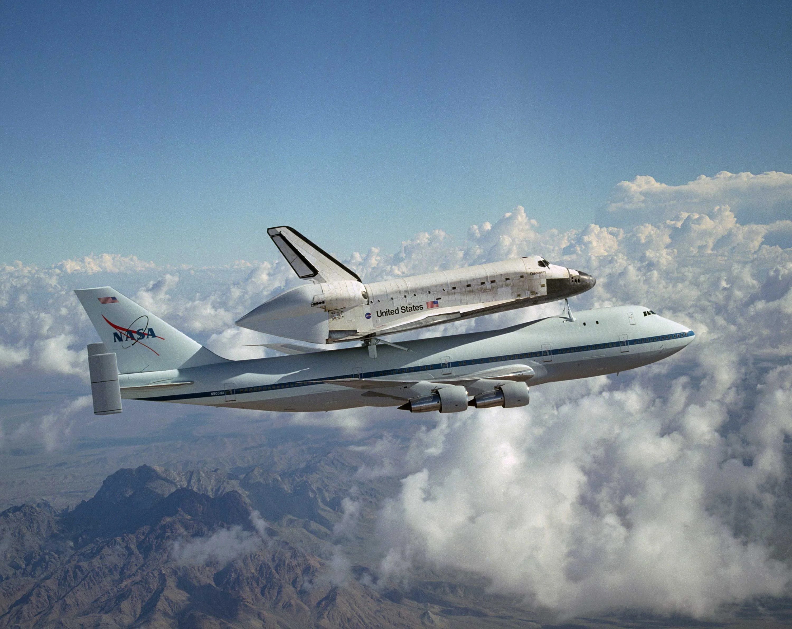

# NASA Orbiter + 747 Glider Design

This dialoge with GPT4 contains instructions for building a balsa wood glider in the shape of a NASA orbiter, with additional details for how to construct another glider in the shape a 747 airjet, which would carry the orbiter attached by neodymium magnets.

The aim of the project is to engineer the gliders so that the orbiter will release from the 747 mid flight.

  

